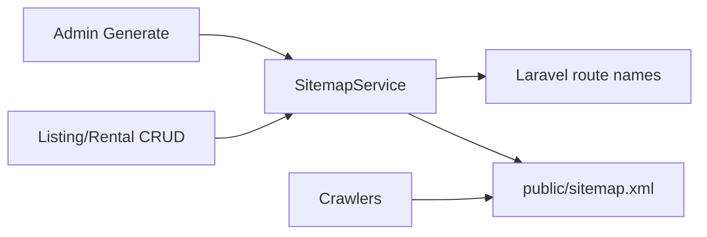
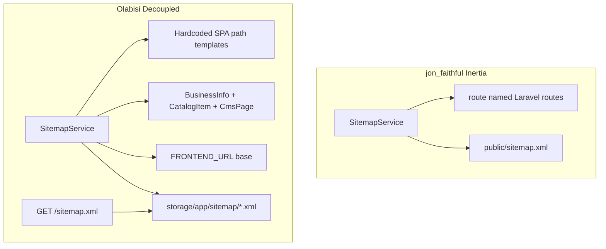

# Olabisi (Gidira) — Dynamic Sitemap Plan (Phase 1)

**Status:** Implemented — ZBC-pattern on-demand `Cache::remember` (no disk file). See [`seo-crawlability-complete.md`](seo-crawlability-complete.md).  
**Date:** 2026-08-02 (updated 2026-08-03)  
**Scope:** Laravel API (`Olabisiolai_Laravel12`) + React SPA (`olabisiolai_frontend_react`)  
**Reference:** `jon_faithful` (Laravel + Inertia); sitemap generation aligned to ZBC News `SitemapService`

> **Content-model note:** This marketplace is **businesses / catalog items / CMS / marketing pages**. There are no `shows` / `comics` / `games` content kinds in Olabisi. Sitemap scope maps to Gidira’s public marketplace URLs below.

---

## 1. Audit: jon_faithful sitemap

### Stack

| Piece | Finding |
|--------|---------|
| Package | `spatie/laravel-sitemap` `^8.0` (locked 8.0.0) |
| Builder | Custom `App\Services\SitemapService` (Spatie **API**, not crawler) |
| Config | `config/sitemap.php` present but **unused** (crawler defaults only) |
| Commands / Jobs | **None** |
| Schedule | **None** (only `queue:work --stop-when-empty` every minute) |

### How it is dynamic

- **Not** request-time XML from a controller.
- **Rebuild-and-write**: `SitemapService::generate()` queries DB + config, builds one Spatie `Sitemap`, writes **`public/sitemap.xml`**.
- Triggers:
  - Admin SEO UI → `POST admin/seo-pages/generate-sitemap`
  - Listing create / update / delete
  - Rental create / update / delete
- Gaps: activate/inactivate does **not** regenerate; committed `sitemap.xml` can contain stale `localhost` hosts until regenerated with production `APP_URL`.

### URL sources (Inertia-relevant)

Because jon_faithful is **Inertia/monolithic**, URLs are built with Laravel **`route()`** named frontend routes (`frontend.home`, `frontend.single-product.listing`, etc.) — same app owns HTML routes and sitemap.

Sources:

1. Static pages from `config('seo.public_pages')`
2. SEO hubs (`SeoHubService`)
3. Quiz SEO pages (`QuizSeoService`)
4. Active `Listing` / `Rental` (`status = 1`) with `updated_at` as `lastmod`

Fields: `lastmod`, `changefreq`, `priority` set per type. No sitemap-index. No `Sitemap:` in `robots.txt`.

### Architecture diagram (jon_faithful)

---

## 2. Audit: Olabisi architecture (sitemap needs)

### Current state

- **No** sitemap code in API or SPA.
- `public/robots.txt` allows all but has **no** `Sitemap:` directive.
- Scheduler already exists: `routes/console.php` → `subscriptions:expire` hourly; Docker `schedule:work` via supervisord.
- **No** `spatie/laravel-sitemap` (or other SEO package) in composer.

### Why Inertia’s approach does not copy 1:1

| jon_faithful | Olabisi |
|--------------|---------|
| Laravel owns page routes | React Router owns page routes |
| `route('frontend…')` → correct absolute URLs via `APP_URL` | Must emit **`FRONTEND_URL`** paths (`https://www.gidira.tech/...`), not `APP_URL` (`https://api.gidira.tech`) |
| Inertia pages live in same deployable | API and SPA are **separate Coolify services** |

Sitemap must be generated by **Laravel** (owns DB + `updated_at` + visibility rules) but `<loc>` values must match **SPA paths**.

### Public URLs to include

**Static (hardcoded path list in config — mirror React `publicRoutes.tsx`):**

- `/`, `/about`, `/contact`, `/faq`
- `/terms`, `/privacy-policy`, `/cookies-policy`, `/community-guidelines`, `/vendor-agreement`, `/refund-policy`
- `/careers` (+ optional static job slugs from frontend constants)
- `/business-tips` + article paths
- `/catalog`, `/filters` (base only; not infinite query permutations)
- Optional acquisition: `/vendor/choose-your-plan`, `/vendor/premium-info`

**Dynamic (DB):**

| Content | Frontend path | Visibility (must match public API) | lastmod |
|---------|---------------|--------------------------------------|---------|
| Business profile | `/businesses/{idOrEncryptId}` | `business_status=active` and `is_flagged=false` | `business_info.updated_at` |
| Catalog item | `/catalog/items/{id}` | Discovery rules: active business + **active Premium** | `business_catalog_items.updated_at` |

**Optional / lower priority:**

- `/businesses/{slug}/catalog`, `/businesses/{slug}/reviews` (often thin; can omit in v1)
- `/filters?category_id={id}` hubs for top-level categories only (no dedicated `/categories/:id` SPA route)

**Exclude:** `/api/*`, admin, auth, `/cart`, `/messages`, `/user/*`, gated `/vendor/*`, checkout, redirects, `*`.

### Business URL encoding

SPA prefers `encryptId(id)` (`g_` + base64url) via `src/lib/encryptId.ts`, but **plain numeric IDs also resolve**. Sitemap should:

1. Prefer the same `encryptId` algorithm in PHP (shared helper) for parity with UI links, **or**
2. Emit numeric `/businesses/{id}` (simpler, already supported).

**Recommendation:** implement a small PHP `encryptId` mirror and emit encrypted slugs so sitemap URLs match what the product UI shares.

### Serving model

Recommended for Coolify split deploy:

1. Laravel exposes **`GET /sitemap.xml`** (and later `/sitemap-*.xml` if needed) on the **API host**, **or** writes files that nginx on **www** can alias — product choice below.
2. Prefer generation on Laravel; advertise in **www** `robots.txt`:  
   `Sitemap: https://www.gidira.tech/sitemap.xml`  
   with www nginx proxying `/sitemap.xml` → API, **or** regenerating into SPA `public/` / CDN.  
   **Preferred v1:** Laravel route on API + also document that www nginx should proxy `/sitemap.xml` and `/robots.txt` Sitemap URL to API, **or** generate into a shared volume. Simplest ops path used by many APIs: serve sitemap from API (`https://api.gidira.tech/sitemap.xml`) and put that absolute URL in both robots files. Crawlers accept sitemap on a different host if declared.

**Recommendation for Olabisi v1:** Serve from Laravel at `https://api.gidira.tech/sitemap.xml` (or path under API), list that URL in SPA `robots.txt` / API `robots.txt`. Optionally later proxy under www for prettier URLs.

---

## 3. Recommended implementation plan

### Package choice

**Use `spatie/laravel-sitemap` (same as jon_faithful).**

| Option | Pros | Cons |
|--------|------|------|
| **Spatie (recommended)** | Proven, same as reference project, Url/priority/lastmod helpers, easy sitemap index later | Extra dependency |
| Fully custom XML | No package | Reinvent escaping, indexes, edge cases |

Do **not** use Spatie’s crawler (`SitemapGenerator`) — SPA routes are not crawlable as Laravel routes. Build programmatically like jon_faithful’s `SitemapService`.

### Generation strategy

**Recommended: scheduled rebuild + static/cached file (or cached response), not pure on-demand every crawl.**

| Strategy | Fit |
|----------|-----|
| On-demand DB every request | Always fresh; DB load on every bot hit |
| **Scheduled write (recommended)** | Matches production practice; plugs into existing `Schedule` + supervisord `schedule:work` |
| Event-driven only (jon_faithful style) | Good for small catalogs; easy to miss status toggles (jon_faithful bug) |

**Concrete recommendation:**

1. `php artisan sitemap:generate` console command → writes `storage/app/sitemap/sitemap.xml` (and index later).
2. Schedule: `Schedule::command('sitemap:generate')->daily();` (or `hourly()` if listings churn high) in `routes/console.php`.
3. Public route `GET /sitemap.xml` streams the latest file (404/empty fallback: generate once or return empty urlset). Optionally `Cache::remember` for 1h as a secondary layer.
4. Also call `sitemap:generate` after admin CMS updates if desired (optional v1.1); do **not** rely solely on CRUD hooks for businesses (high volume / many code paths).

This improves on jon_faithful by using the **scheduler** (already in Docker) and avoiding stale activate/inactivate gaps.

### Content scope (v1 checklist)

| # | Source | Include |
|---|--------|---------|
| 1 | Config list of static SPA paths | Yes |
| 2 | `BusinessInfo` active + not flagged | Yes |
| 3 | Discoverable `BusinessCatalogItem` (premium + active parent) | Yes |
| 4 | CMS pages (`about_us`, `privacy_policy`, `terms`) — paths only; lastmod from `CmsPage.updated_at` when row exists | Yes |
| 5 | Category filter hubs | Optional v1.1 |
| 6 | Careers job detail slugs | Optional (frontend-only; hardcoded) |
| 7 | Auth/admin/cart/messages | No |

Reuse existing visibility helpers where possible (`applyPublicMarketplaceVisibility`, catalog `discoveryBaseQuery`) so sitemap never lists unpublished / inactive / free-tier-hidden catalog items incorrectly.

### lastmod / changefreq / priority (proposed)

| Type | lastmod | changefreq | priority |
|------|---------|------------|----------|
| Home | generation time or fixed | daily | 1.0 |
| Static marketing | generation time or CmsPage `updated_at` | weekly | 0.7–0.8 |
| Business profile | `updated_at` | daily | 0.9 |
| Catalog item | `updated_at` | daily | 0.8 |

### Sitemap index

- Start with **one** `sitemap.xml`.
- If URL count approaches protocol limits (~50k) or file size ~50MB, split:
  - `sitemap-static.xml`
  - `sitemap-businesses.xml` (chunked)
  - `sitemap-catalog.xml` (chunked)
  - Index at `/sitemap.xml`
- Unlikely at current seed scale; design the service with a chunking hook so we do not rewrite architecture later.

### File / route / class placement (match project conventions)

| Piece | Location |
|-------|----------|
| Package | `composer require spatie/laravel-sitemap` |
| Config | `config/sitemap-urls.php` (static SPA paths + priorities) — **not** Inertia route names |
| Service | `app/Services/SitemapService.php` |
| Command | `app/Console/Commands/GenerateSitemapCommand.php` (`sitemap:generate`) |
| Schedule | `routes/console.php` |
| HTTP | `app/Http/Controllers/Api/V1/Public/SitemapController.php` + route in `routes/api/v1/public.php` **or** a top-level web route outside `/api` prefix so URL is `/sitemap.xml` cleanly |
| Helper | `app/Support/FrontendUrl.php` + `encryptId()` PHP port |
| Env | `FRONTEND_URL` (already present) used as base for `<loc>` |
| robots | Update API `public/robots.txt` and SPA nginx/`public/robots.txt` with `Sitemap:` line |

**Route note:** Prefer a dedicated web route `GET /sitemap.xml` (not under `/api/v1`) so crawlers get a conventional URL. Laravel’s `routes/web.php` or a small `routes/sitemap.php` included from `bootstrap/app.php` fits better than nesting under API versioning.

### Nginx (SPA)

If sitemap is served only from API host: no SPA nginx change required beyond robots.  
If www should expose `/sitemap.xml`: add a proxy/`try_files` alias in the **frontend** nginx — out of scope for v1 if we advertise the API sitemap URL.

---

## 4. Key architectural differences (summary)

---

## 5. Phase 2 implementation outline (after approval)

1. Add `spatie/laravel-sitemap`.
2. Add `config/sitemap-urls.php` + `FrontendUrl` / `encryptId` helpers.
3. Implement `SitemapService` + `sitemap:generate`.
4. Schedule daily; wire `GET /sitemap.xml`.
5. Update `robots.txt` (`Sitemap:`).
6. Feature test: active business included, flagged/inactive excluded, catalog item respects premium discovery, static paths present, `<loc>` uses `FRONTEND_URL`.
7. Document in README (short section).

---

## 6. Open decisions for approval

1. **Sitemap host:** API-only URL vs www proxy to API? *(Recommend API URL in robots for v1.)*
2. **Business `<loc>` format:** encrypted `g_…` slug vs numeric id? *(Recommend encrypted for parity.)*
3. **Include** `/businesses/{slug}/catalog|reviews` and category filter hubs in v1? *(Recommend omit / optional.)*
4. **Regenerate cadence:** daily vs hourly? *(Recommend daily.)*

---

**Stop here.** No implementation until this plan is approved (with answers to §6 if preferences differ).

---

## 7. Post-implementation test baseline

Phase 2 shipped as commit `9852f16`. Live parent-vs-HEAD verification (local worktree, no remote ops) confirmed the suite’s durable failures are **pre-existing**, not introduced by sitemap shared-file hooks. Full names and evidence: **[`docs/test-baseline.md`](test-baseline.md)** (60 solid + 1 pre-existing flake ≈ **61** when the flake fails).

## 8. Admin SEO phase (jon_faithful parity for split API + SPA)

Shipped: seeded `seo_pages` keyed by SPA path, admin meta CRUD + Generate Sitemap (`Cache::lock`), public `GET /api/v1/seo-pages/by-path?path=…`, React `/admin/seo` + public `DocumentHead`. Static sitemap `lastmod` prefers `SeoPage.updated_at` when a row exists. Inventory remains config/seeded (no free-form path creation). Named SEO permissions and public meta caching are deferred.

## 9. SEO crawlability (CSR gap) — next

Phase 1 audit confirmed CSR-only SPA. **v1 + ZBC-pattern (shipped in code):** Laravel `SeoResolverService` + spa-shell + dynamic `/robots.txt` + sitemap (no Google News sitemap) + www nginx proxy for robots/sitemap/HTML. Plans: [`seo-crawlability-phase2.md`](seo-crawlability-phase2.md), [`seo-crawlability-complete.md`](seo-crawlability-complete.md).
